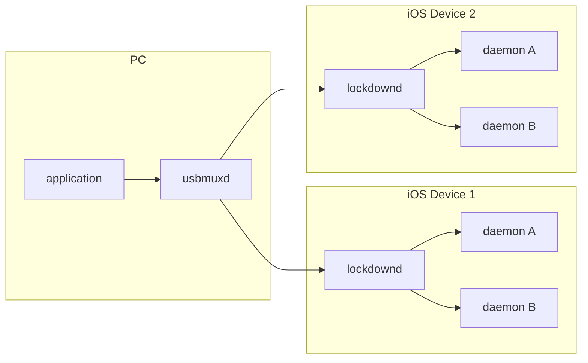

# xcdevice

A library to communicate with services on iOS devices that does not require jailbreaking.

## talking to devices

Xcode normally communicates with the iPhone using something called "usbmux" – 
this is a system for multiplexing several “connections” over one physical USB
connection. Conceptually, it provides a TCP-like system – processes on the host
machine open up connections to specific, numbered ports on the mobile device.

### usbmuxd

Applications open a connection to the usbmuxd daemon when they want to talk to
a device. usbmuxd maintains a list of iOS devices connected to the PC, and also
manages the trust relationship between the iOS device and the PC.



### lockdownd

When usbmuxd connects to a device, it sets up a connection to the lockdown
service running on that device. From this point on, it is the lockdownd that
responds to the messages sent over the connection.

## debugging the connection

There is no official documentation available, so the best way to reverse engineer
the messages is to observe an "official" application such as iTunes or Xcode.

The data sent over the connection is mostly plain text until a connection to
lockdownd is established at which point it converts to a TLS enabled connection,
but before that happens, the messages on the wire can be observed with the socat
utility.

socat is a multipurpose relay tool for bidirectional data transfers between two 
independent channels. For example, unix pipes, devices, sockets, files, etc.

```sh
brew install socat

# rename the socket, so that it can be replaced by socat
sudo mv /var/run/usbmuxd /var/run/usbmuxx

# start the relay. add `-x` for byte debug
sudo socat -t100 -v UNIX-LISTEN:/var/run/usbmuxd,mode=777,reuseaddr,fork UNIX-CONNECT:/var/run/usbmuxx

# undo changes
sudo mv /var/run/usbmuxx /var/run/usbmuxd
```

## developer disk images

Running an app requires a matching developer disk image to be mounted on the
device. You can list available images like so:

```sh
ls -al /Applications/Xcode.app/Contents/Developer/Platforms/iPhoneOS.platform/DeviceSupport/
```

## contributing

You can contribute in many ways and not just by changing the code! If you have any ideas, just open an issue and tell me what you think.

Contributing code-wise - please discuss larger changes via an issue before submitting a pull request. Otherwise, fork the repository and submit a pull request!

## license

MIT
